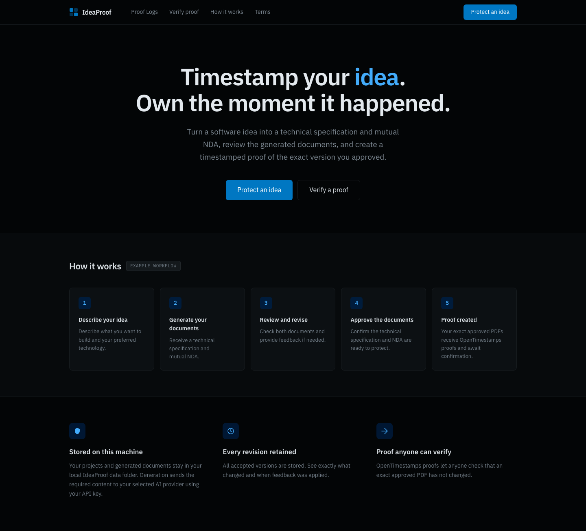
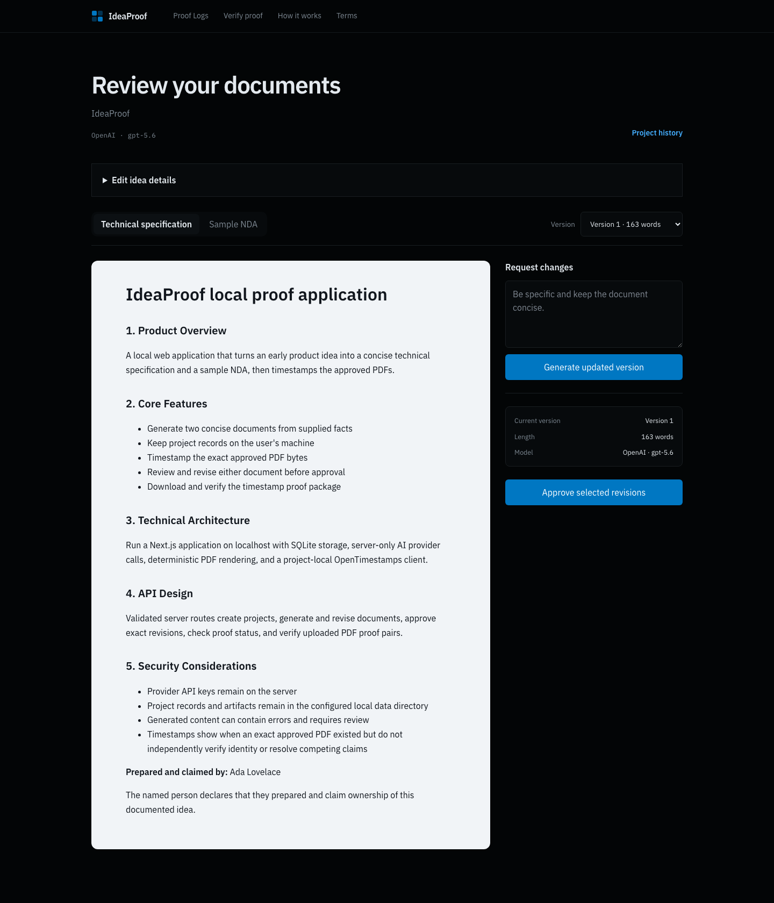

# IdeaProof

IdeaProof is an open-source, local-first web app for turning an early product
idea into two concise, reviewable documents:

- a technical specification;
- a sample NDA template.

After review, IdeaProof renders the selected revisions as PDFs and creates a
digital fingerprint of each exact file. OpenTimestamps receives those
fingerprints—not the PDFs or their contents—and returns matching proof files.
IdeaProof runs in your browser at
[http://localhost:3000](http://localhost:3000), while the application and its
SQLite data remain on your machine.





## Owner declaration and important limits

Each new project requires the idea owner’s full name. IdeaProof stores that
name locally, does not send it to the selected AI provider, and appends this
declaration to the technical specification:

> **Prepared and claimed by:** Owner’s full name
>
> The named person declares that they prepared and claim ownership of this
> documented idea.

The named person must affirm that declaration before first approval. It becomes
part of the exact approved PDF and therefore part of that PDF’s digital
fingerprint. A confirmed timestamp shows that the exact approved PDF existed by
a certain time; it does not independently verify identity, resolve competing
ownership claims, establish patent rights, or determine legal validity.

The sample NDA is not legal advice, and AI-generated content can contain
errors. Review both documents before approval and consult a qualified lawyer
when appropriate.

Document generation sends the required idea and NDA purpose to the AI provider
you select using your API key. Local verification does not send uploaded PDFs
to an AI provider or OpenTimestamps.

## Requirements

- Node.js 24.14 or newer
- npm 10 or newer
- Python 3.9 or newer
- an OpenAI API key, an Anthropic API key, or both

## Install and run

1. On GitHub, choose **Code**, select **HTTPS**, and copy the repository URL.
2. Clone that URL and enter the project:

   ```bash
   git clone <HTTPS URL copied from GitHub>
   cd ideaproof
   ```

3. Create the local environment file:

   ```bash
   cp .env.example .env
   ```

4. Open `.env` and set:

   ```dotenv
   OPENAI_API_KEY=
   OPENAI_MODEL=gpt-5.6
   ANTHROPIC_API_KEY=
   ANTHROPIC_MODEL=claude-opus-4-8
   IDEAPROOF_DATA_DIR=./data
   ```

   Add at least one API key after its equals sign. Leave the unused key blank.

5. Install the Node and project-local OpenTimestamps dependencies:

   ```bash
   npm install
   npm run setup
   ```

6. Build and start:

   ```bash
   npm run build
   npm start
   ```

7. Open [http://localhost:3000](http://localhost:3000).

The API key stays in the server process and is not returned to the browser,
stored in SQLite, or included in proof packages. Keep `.env` private; it is
ignored by Git.

## Choosing an AI provider

IdeaProof shows only the providers configured in `.env`:

- OpenAI key only: new projects use OpenAI.
- Anthropic key only: new projects use Claude.
- Both keys: choose OpenAI or Claude when creating each project; OpenAI is
  selected by default.
- No keys: document generation stays disabled and Setup explains what is
  missing.

One provider and model are fixed for each project. The same choice generates
both documents and every later revision, so a project cannot silently switch
providers. OpenAI defaults to `gpt-5.6`; Anthropic defaults to
`claude-opus-4-8`. You may change either model variable for future projects,
but the named model must be available to your API account.

Each project also requires a short **Idea name**. IdeaProof uses it as the
project title and supplies it to the selected AI provider with the idea.

The generated technical specification is limited to 1,000 words. The sample
NDA is limited to 700 words and deliberately leaves Party A, Party B, Effective
Date, and Confidentiality Period blank unless you provide those facts.

## Idea updates and document regeneration

Before approval, **Edit idea details** lets you change the Idea name or expand
the raw idea. Every save appends a complete snapshot to **Project history**;
older snapshots remain available with their local date and time. These local
history dates are not OpenTimestamps proofs.

Saving an idea update stays on your machine and makes no AI request. Because
existing documents describe the earlier snapshot, IdeaProof then blocks
approval until you choose **Regenerate both documents · 2 AI requests**.
Normal regeneration makes one request for the technical specification and one
for the sample NDA. A document may need one extra shortening request only when
the first response exceeds its word limit.

## Development

```bash
npm run dev
npm run lint
npm run typecheck
npm test
npm run test:e2e
npm run verify
```

The end-to-end suite exercises both provider choices with development-only
deterministic fixtures. It does not call OpenAI, Anthropic, or public timestamp
calendars.

## Local data and backups

By default, IdeaProof stores its SQLite database and approval artifacts under
`data/`. Change `IDEAPROOF_DATA_DIR` to use another local folder.

To back up your work, stop IdeaProof and copy the entire data directory.
Application-level encryption is not provided, so use your operating system's
disk encryption and access controls when the ideas are sensitive.

## Proof packages

Each approved ZIP contains only:

- `technical-specification.md`
- `technical-specification.pdf`
- `technical-specification.pdf.ots`
- `sample-nda.md`
- `sample-nda.pdf`
- `sample-nda.pdf.ots`
- `manifest.json`

Packages created by earlier IdeaProof versions with `mutual-nda.*` filenames
remain valid and can still be verified; existing stored packages are not
renamed.

The manifest identifies the approved revisions, prompt versions, word counts,
providers, models, PDF digital fingerprints, and approval time. The technical
specification files contain the locally appended owner declaration. The
manifest excludes intake text, revision feedback, API keys, database files, and
internal paths.

OpenTimestamps confirmation can take hours. Use **Check confirmation** on the
proof page later. To verify independently in IdeaProof, open **Verify proof** and
select a PDF together with its matching `.ots` file. Any change to the PDF
causes a mismatch.

## Optional Docker Compose

Docker is not required and does not change the UI. The direct setup above is
the primary workflow. If Docker is available:

```bash
cp .env.example .env
# Add OPENAI_API_KEY, ANTHROPIC_API_KEY, or both to .env
docker compose up --build
```

Compose binds only `127.0.0.1:3000` and mounts `./data` for persistence.

## Troubleshooting

### Setup status

Open [http://localhost:3000/setup](http://localhost:3000/setup) to check the API
key, writable data folder, Python, and the project-local `ots` executable. The
page reports readiness without exposing secret values or internal paths.

### OpenTimestamps is missing

Confirm Python is available, then rerun:

```bash
python3 --version
npm run setup
```

On Windows, `py -3 --version` is also supported.

### AI generation fails

Check the selected provider's key and model in `.env`, then restart IdeaProof.
Authentication, rate-limit, refusal, malformed-output, and length errors are
reported without logging the key or raw response.

### Proof remains pending

This can be normal while OpenTimestamps completes confirmation. Wait and use
**Check confirmation** again. Do not edit the PDF or `.ots` file.

### Port 3000 is already in use

Stop the process using port 3000 before starting IdeaProof. The supported
browser URL is `http://localhost:3000`.

## Project policies

See [CONTRIBUTING.md](CONTRIBUTING.md), [LICENSE](LICENSE), and
[THIRD_PARTY_NOTICES.md](THIRD_PARTY_NOTICES.md).

The MIT license covers IdeaProof's original source code. It does not replace
the licenses of third-party packages, fonts, generated content, or user data.
